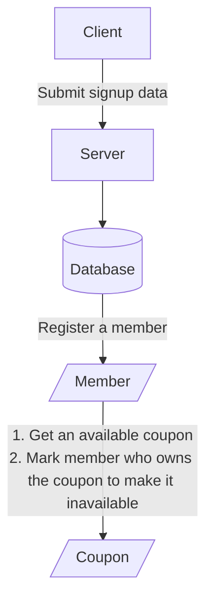

# Table of contents

- [Description](#description)
- [Flowchart](#flowchart)
- [Code written by others before optimizing](#code-written-by-others-before-optimizing)
- [Requirement](#requirement)
- [Installation](#installation)

## Description

Memo of dealing with race conditions by using **Laravel Redis Lock** & **InnoDB Record Lock**

## Flowchart



## Code written by others before optimizing

```php
public sendCoupon(Member $member) {
    $coupon = Coupon::where('member_id', null)->get()->first();
    
    if (is_null($coupon)) {
        throw new Exception('no issuable coupon', 1);
    }
    
    try {
        DB::beginTransaction();
        $coupon->member_id = $member->id;
        $coupon->redeemed_at = date('Y-m-d H:i:s');
        $coupon->save();
        DB::commit();
    } catch (Throwable $th) {
        DB::rollback();
        throw new Exception('send coupon failed', 1);
    }
}
```

## Requirement

- Docker

## Installation

1. By running commands below, docker will build 4 containers: app (including PHP 8.1, Golang 1.18, k6, xk6), nginx, mysql, redis

    ```bash
    git clone https://github.com/uhcakip/coupon-race-condition.git
    
    cd path/to/project
    
    make start
    ```

2. Access Docker container and build k6 with extension

    ```bash
    make exec-app
    
    cd k6
    
    xk6 build --with github.com/szkiba/xk6-faker
    ```

3. Running API stress test

    ```bash
    ./k6 run scripts/sign-up.js
    ```